# gSerial Enabler
**"plug-n-play" gcomp/gscart EXT adapter that enables auto-profiles for the RetroTink 4K**

 - A powered-on console on port 1-8 will load SVS profiles S201_ - S208_ on the RT4K Pro/CE
 - Compatible with the SVS
 - Connect multiple gSerial Enablers, Donut Holes, Donut Dongles simultaneously via a headphone jack splitter.
   - Must reflash "firmware" with offset variable set so SVS profile numbers don't overlap.
   - Ex: offset = 8, adds 8 to the default of 201. So ports 1 - 8 would now be S209_ - S216_
   - Up to 5 have been connected together simultaneously. More may be supported, but this is the max number I've been able to test.
 - Full instructions listed below for building your own!
 - If DIY is not your thing, I also have a handful assembled and available for purchase on [Ko-fi](https://ko-fi.com/donutswdad/shop)

> [!NOTE]
> EXT pins do not exist on all gscart/gcomp revisions. Make sure your switch has them! There are now 2 versions available.
>  - "Internal" is for EXT with no header.
>  - "External" is for EXT with right angle header populating the port.

# Internal
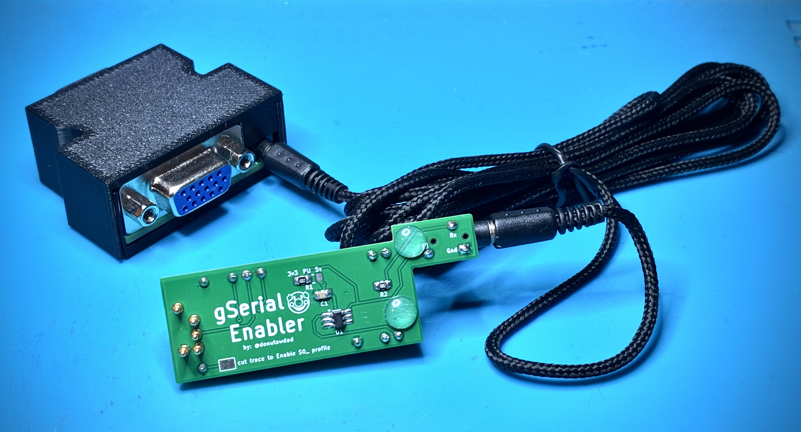
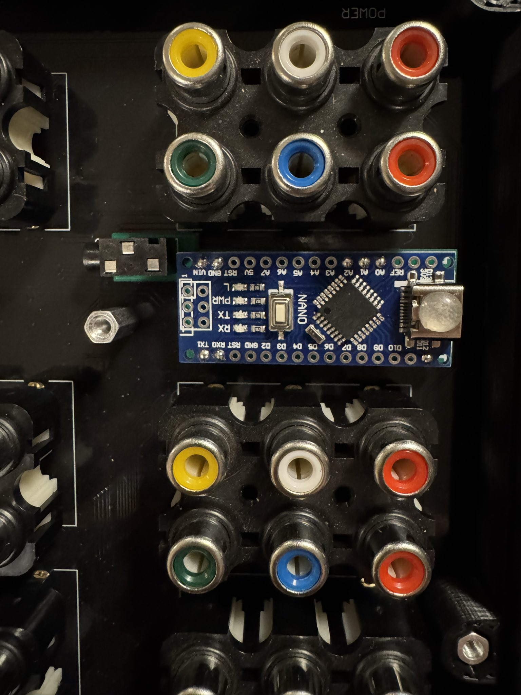
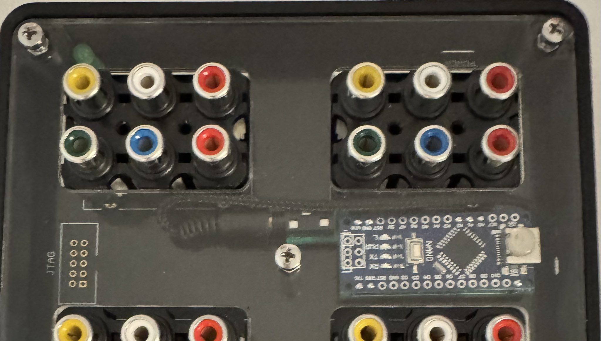
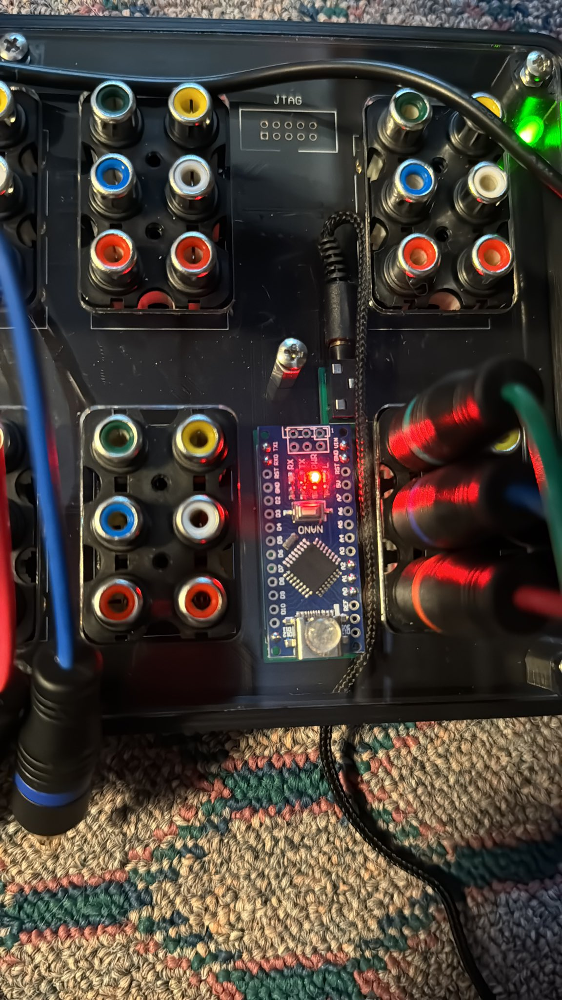
<br />
<br />

# External
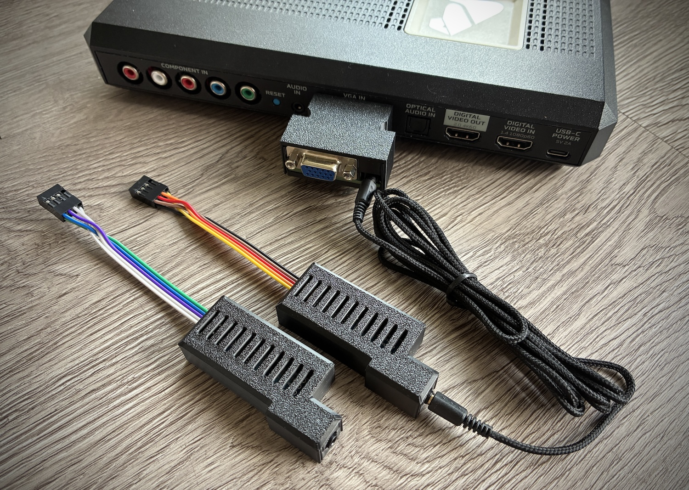
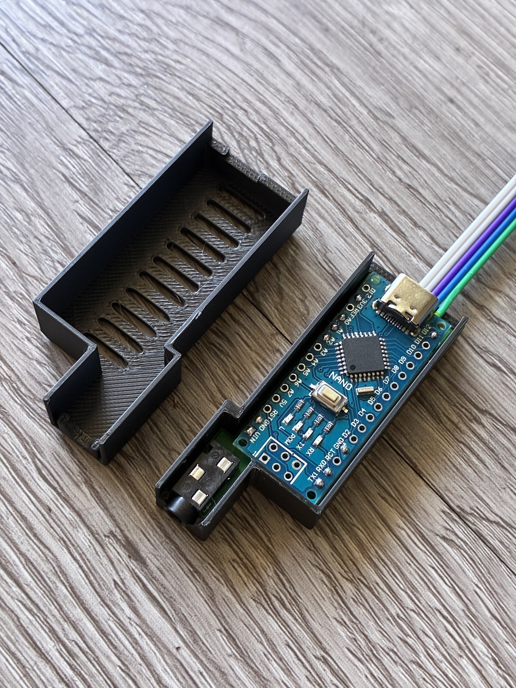
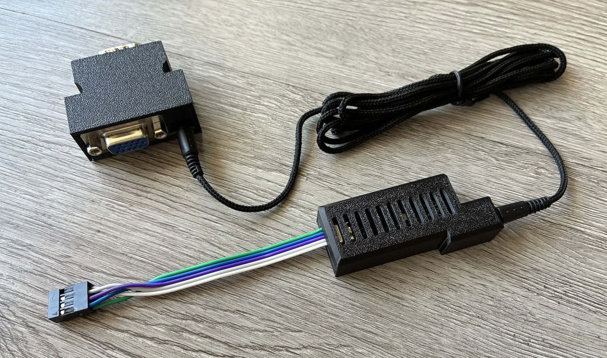
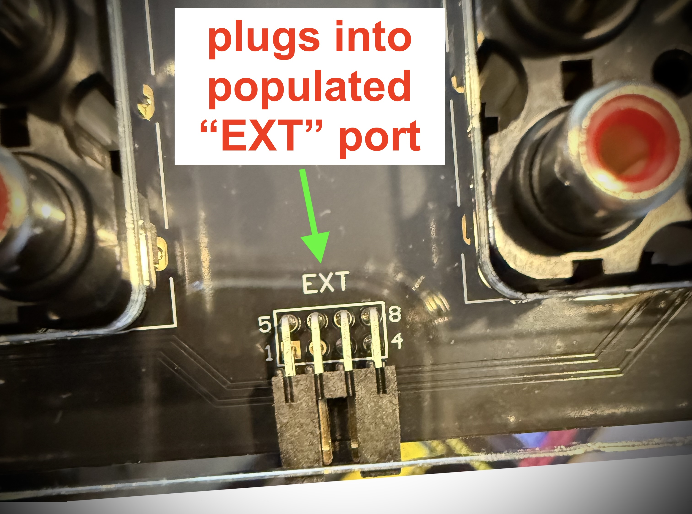

# Thanks to 
   - **[@UstSte](https://x.com/UstSte) for the photos and testing.**

   - **Bob @ [RetroRGB](https://www.retrorgb.com/retrotink-4k-firmware-v1-6-9-released.html) for the idea.**

<br />
<br />

# Ordering PCBs
PCBs for this project:
 - [gSerial Enabler (Internal)](https://github.com/svirant/gSerialEnabler/blob/main/gSerial_Enabler.zip)
 - [gSerial Enabler (External)](https://github.com/svirant/gSerialEnabler/blob/main/gSerial_Enabler_External.zip)
    - [3DP Case (External)](https://github.com/svirant/gSerialEnabler/blob/main/gSerial_Enabler.3mf)
 - [VGA Adapter](https://github.com/svirant/DonutDongle/tree/main/Adapters) (VGAPassthrough or YC2VGA)
 
There are plenty of options for PCB manufacturing but I prefer [JLCPCB](https://jlcpcb.com) (No affiliation). Using the gerber (.zip) files provided, it's easy to place an order. Below are some tips/guidelines:
- 1.6mm Thickness
- For Surface Finish, "HASL(with lead)" is fine
- 4 Layer PCBs are the same cost as 2 Layer for the VGA Adapters. Because of that, the inner 2 layers are being used as ground planes for better EMI protection. Thanks to https://x.com/zaxour for the idea!
- "Remove Mark" option is now free on JLCPCB. Use it!
- All remaining default options should be fine
- Let me know if you have any questions!

# Assembly

[Interactive HTML BOM](https://svirant.github.io/gSerialEnabler/images/ibom.html)

[](https://svirant.github.io/gSerialEnabler/images/ibom.html)

## Internal assembly
In addition to the top of the usb-c port, place two more 6x2mm rubber feet to the spots shown, to secure the PCB.

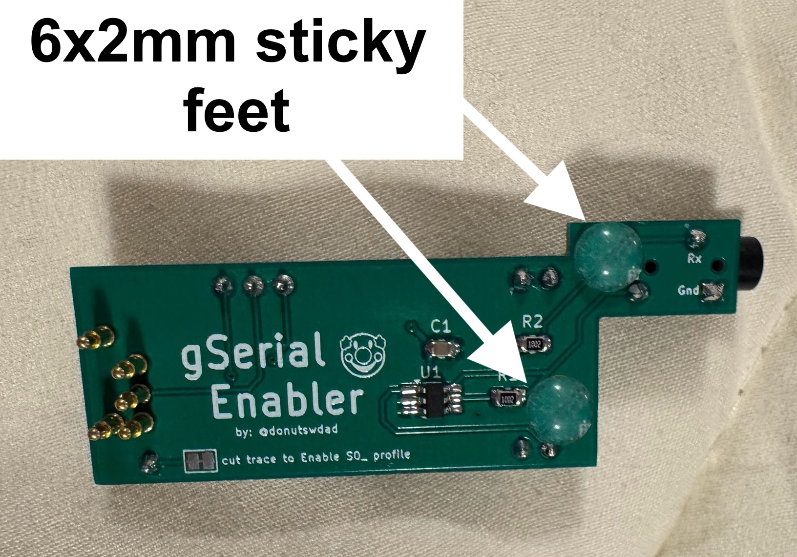 </br>

## External assembly
 - Cut Dupont line in half for 10cm section. 
 - Remove plastic covers on Dupont line and insert into 2x4 Dupont shell as shown below.
 - Strip wire on other end and solder into vias on PCB.

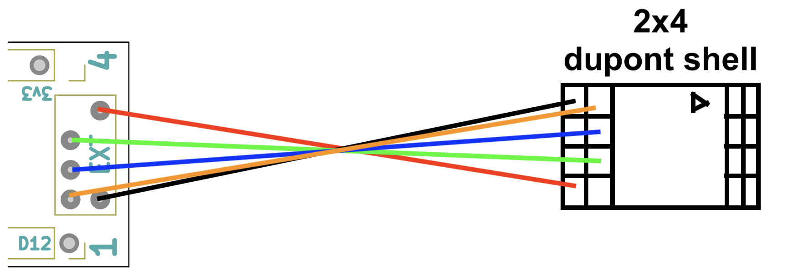 </br>


# PCB
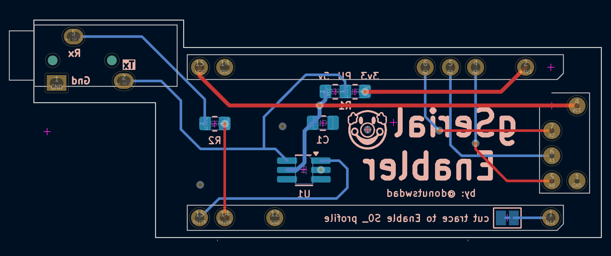

# Schematic
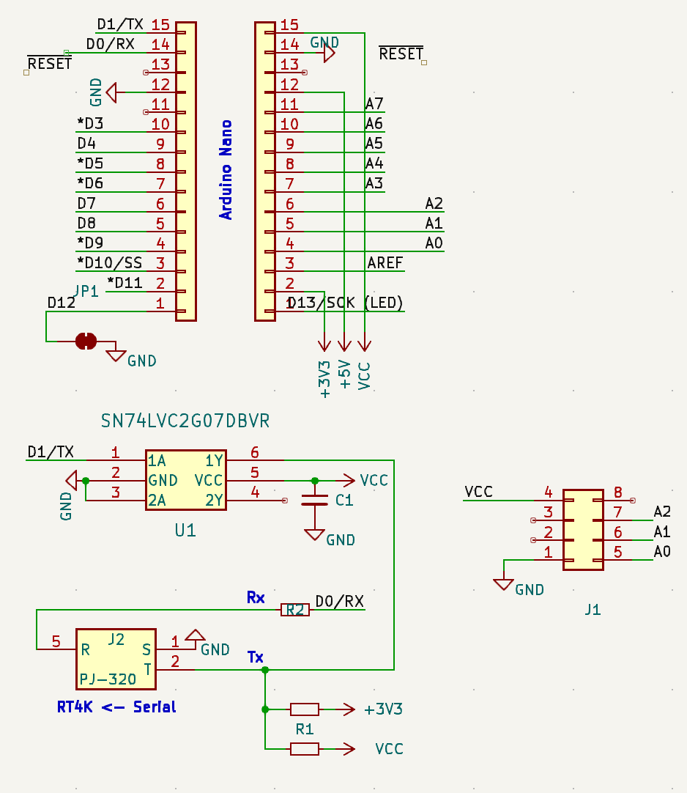


## Bill of Materials (BOM)

### * gSerial Enabler
| **Qty**    | Designation | Part |  Link  |  Notes |
| ------------- | ------------- |------------- |------------- |------------- |
| 1  | C1 | 0.1 uf / 100nf 50V X7R 0805 Capacitor| [Digikey](https://www.digikey.com/en/products/detail/yageo/CC0805KRX7R9BB104/302874?s=N4IgTCBcDaIMwEYEFokBYAMrkDkAiIAugL5A) | |
| 2  | R1, R2 | 10K OHM 1% 1/8W 0805 Resistor | [Digikey](https://www.digikey.com/en/products/detail/yageo/AC0805FR-0710KL/2827834) | |
| 1  | U1 | IC BUF NON-INVERT 5.5V SOT23-6 | [Digikey](https://www.digikey.com/en/products/detail/texas-instruments/SN74LVC2G07DBVR/486427) or [alternate](https://www.digikey.com/en/products/detail/umw/SN74LVC2G07DBVR/24889644) | |
| 1  | J2 | PJ-320 3.5MM Headphone Jack Audio Video Female | [AliExpress](https://www.aliexpress.us/item/3256807448104402.html) | Color: PJ-320B DIP | 
| 10  | J3,J4 | 2.54mm male pin headers | break off the male headers that come with the Arduino Nano | | 
| 1  | | Arduino Nano type c | Support [RetroRGB!](https://amzn.to/4gnHqN4) | Make sure the headers are not soldered. |
| 1  | | Any 3.5mm / aux / stereo / trs / cable | [AliExpress](https://www.aliexpress.us/item/2255799962255486.html) | I prefer the one listed because the cable itself is very flexible and has no problem being routed inside the case.|
| 1  | | usb-c cable for Arduino programming | [AliExpress](https://www.aliexpress.us/item/3256806983355947.html) | |
| 3 | | 6x2mm sticky rubber feet | [Amazon](https://www.amazon.com/dp/B06XCNM69B)| Internal version only |
| 5 | Pogo-Pin | Mill-Max 0906-1-15-20-75-14-11-0 | [Digikey](https://www.digikey.com/en/products/detail/mill-max-manufacturing-corp/0906-1-15-20-75-14-11-0/1147049) | Internal version only |
| 1 | 2x4 Dupont shell | Pins: 2x4Pin | [AliExpress](https://www.aliexpress.us/item/2255800942949805.html) | External version only | 
| 1 | Dupont line 20cm | Color: Female to Female | [AliExpress](https://www.aliexpress.us/item/3256805315188857.html) | External version only |

### * VGA Adapter assembly and BOM can be found [here](https://github.com/svirant/DonutDongle?tab=readme-ov-file#at-least-1-of-the-following-vga-adapters-is-required)
<br />

# Programming an Arduino Nano
I recommend the [Official Arduino IDE and guide](https://www.arduino.cc/en/Guide) if you're unfamiliar with Arduinos. All .ino files used for programming are listed above. 

Some Arduino Nanos come with an Old Bootloader and won't Upload unless specified. **If you get errors** when trying to upload, swap to this option as a possible fix.

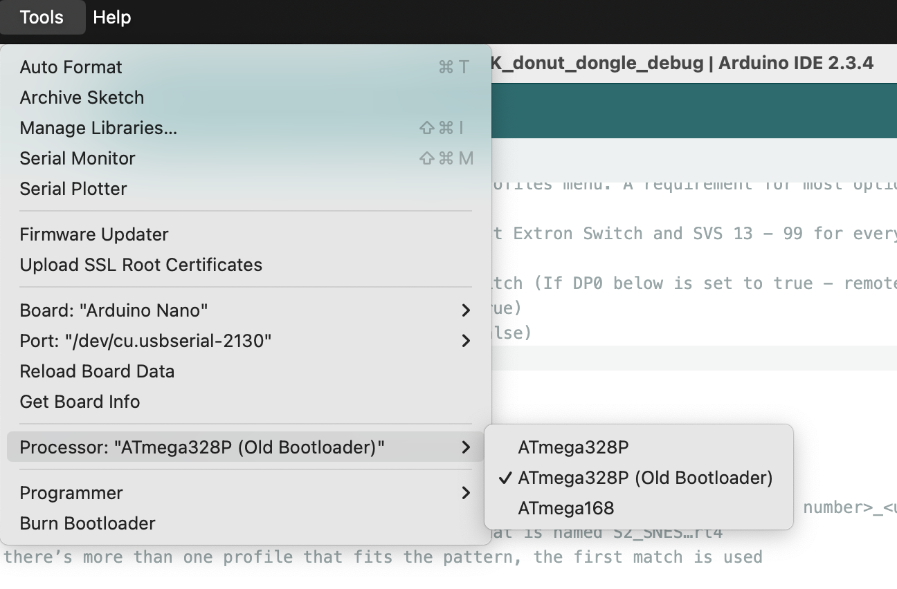

## Steps to update offset
 - 1 - Download and install the [Arduino IDE](https://www.arduino.cc/en/software/) for your PC or Mac
 - 2 - Click the green "<> Code" button above and "Download ZIP".
 - 3 - Extract the .zip file and open up the "gSerial_Enabler.ino" file in the Arduino IDE. It will ask if you would like to move this file inside a folder, select OK.
 - 4 - With the source code now open, select "Tools" -> "Board" -> "Arduino AVR Boards" -> "Arduino Nano"
 - 5 - Connect the gSerial Enabler device to your PC or Mac using a usb-c cable. You should see an LED light up when connected.
   - If connecting the "External" version, you must remove the top half of the case by sliding it upwards while holding parts beneath the aux jack on one side and ribbon cable on other. This will expose the usb-c port.
   - If connecting the "Internal" version, it's okay to flash it while still inside the gscart/gcomp. Just disconnect power from the gscart/gcomp first.
 - 6 - With the gSerial Enabler now connected, select it's "port" by going to "Tools" -> "Port", and select the port that starts with "/dev/cu.usbserial-" (on Mac) or "COM" if on PC.
 - 7 - Almost done! :) In the code itself, find the line that starts with "uint16_t const offset = 0;" and change the 0 to an 8. It should now look like this: uint16_t const offset = 8;
   - At the moment this is line 27
 - 8 - From the menu at the top, select "Sketch" -> "Upload". You should see the LEDs on the Arduino Nano flicker and a message that says "Done uploading." if successful.
 - 9 - Disconnect the usb-c cable and give it a whirl! You can repeat these steps in the future to make any other changes or update if a newer firmware is ever released.
  -----------
# How to Use
- Make sure **"Auto Load SVS"** is **"On"** under the RT4K Profiles menu.  
- The RT4K checks the **/profile/SVS** subfolder for profiles and need to be named: **S\<input number>_\<user defined>.rt4**  For example, SVS input 201 would look for a profile that is named S201_SNES.rt4.  If there’s more than one profile that fits the pattern, the first match is used.

- Check the RT4K Diagnostic Console for Serial commands being received as confirmation.


## SVS Profile numbering scheme

**Ports 1-8 = S201\_ - S208\_**

The "offset" option can be used if using multiple gSerial Enablers connected to the RT4K via a headphone splitter. If using a 2nd, change to "offset = 8" for the 2nd to be SVS profiles 209 - 216.

```
uint16_t const offset = 0; // Only needed for multiple gSerial Enablers. Set offset so 2nd, 3rd, etc gSEs don't overlap profiles. (e.g. offset = 8;) 
```

## S0_ profile Enable

By cutting the trace on the PCB, you can enable the S0_ profile which will load S0_\<whatever\>.rt4 when all inputs are off. If you wish to revert the change, you can bridge the trace with a solder blob. 

Instead of cutting the trace, you can also change line 29 of the gSerial_Enalber.ino to "true" for the same functionality. ...Assuming you are able to program the Arduino Nano with the updated .ino. Up to you which method to choose.
