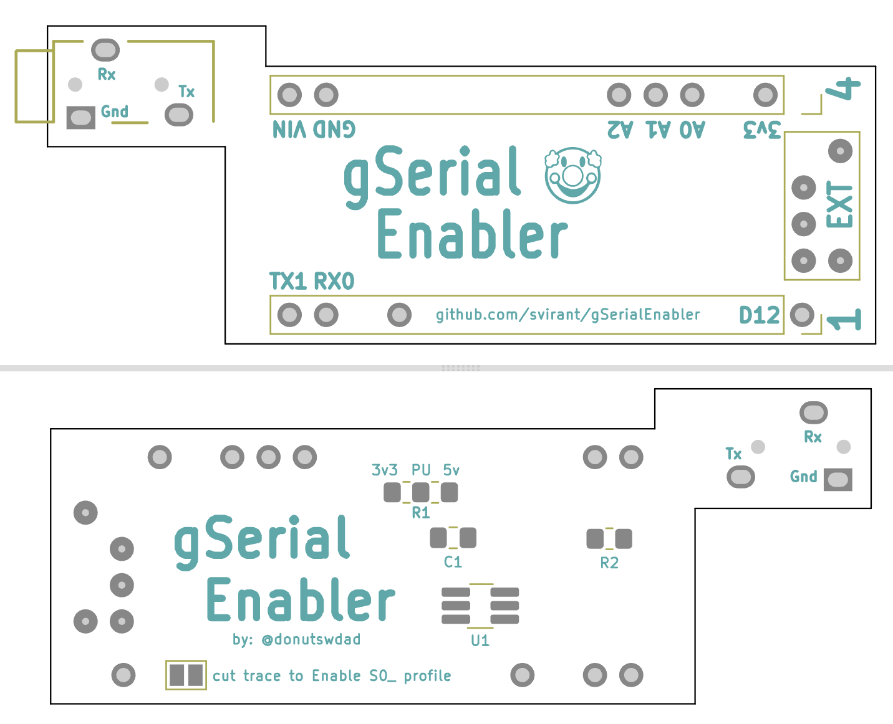

# gSerial Enabler
**"plug-n-play" gcomp/gscart EXT adapter that enables auto-profiles for the RetroTink 4K**


<br />
<br />

# Ordering PCBs
PCBs for this project:
 - [gSerial Enabler](https://github.com/svirant/gSerialEnabler/blob/main/gSerial_Enabler.zip)
 - [VGA Adapter](https://github.com/svirant/DonutDongle/tree/main/Adapters) (VGAPassthrough or YC2VGA)
 
There are plenty of options for PCB manufacturing but I prefer [JLCPCB](https://jlcpcb.com) (No affiliation). Using the gerber (.zip) files provided, it's easy to place an order. Below are some tips/guidelines:
- 1.6mm Thickness
- For Surface Finish, "HASL(with lead)" is fine
- 4 Layer PCBs are the same cost as 2 Layer for the VGA Adapters. Because of that, the inner 2 layers are being used as ground planes for better EMI protection. Thanks to https://x.com/zaxour for the idea!
- "Remove Mark" option is now free on JLCPCB. Use it!
- All remaining default options should be fine
- Let me know if you have any questions!

# Assembly

[Interactive HTML BOM](https://svirant.github.io/gSerialEnabler/images/ibom.html)

[](https://svirant.github.io/gSerialEnabler/images/ibom.html)

# PCB


# Schematic


## Bill of Materials (BOM)

* **gSerial Enabler PCB**

| **Qty**    | Designation | Part |  Link  |  Notes |
| ------------- | ------------- |------------- |------------- |------------- |
| 1  | C1 | 0.1 uf / 100nf 50V X7R 0805 Capacitor| [Digikey](https://www.digikey.com/en/products/detail/yageo/CC0805KRX7R9BB104/302874?s=N4IgTCBcDaIMwEYEFokBYAMrkDkAiIAugL5A) | |
| 2  | R1, R2 | 10K OHM 1% 1/8W 0805 Resistor | [Digikey](https://www.digikey.com/en/products/detail/yageo/AC0805FR-0710KL/2827834) | |
| 1  | U1 | IC BUF NON-INVERT 5.5V SOT23-6 | [Digikey](https://www.digikey.com/en/products/detail/texas-instruments/SN74LVC2G07DBVR/486427) | |
| 1  | J2 | PJ-320 3.5MM Headphone Jack Audio Video Female | [AliExpress](https://www.aliexpress.us/item/3256807448104402.html) | Color: PJ-320B DIP | 
| 5 | Pogo-Pin | Mill-Max 0906-1-15-20-75-14-11-0 | [Digikey](https://www.digikey.com/en/products/detail/mill-max-manufacturing-corp/0906-1-15-20-75-14-11-0/1147049) | |


# Programming an Arduino Nano
I recommend the [Official Arduino IDE and guide](https://www.arduino.cc/en/Guide) if you're unfamiliar with Arduinos. All .ino files used for programming are listed above. 

Some Arduino Nanos come with an Old Bootloader and won't Upload unless specified. **If you get errors** when trying to upload, swap to this option as a possible fix.


  -----------
# How to Use
- Make sure **"Auto Load SVS"** is **"On"** under the RT4K Profiles menu.  
- The RT4K checks the **/profile/SVS** subfolder for profiles and need to be named: **S\<input number>_\<user defined>.rt4**  For example, SVS input 2 would look for a profile that is named S2_SNES.rt4.  If there’s more than one profile that fits the pattern, the first match is used.

- Check the RT4K Diagnostic Console for Serial commands being received as confirmation.


## SVS Profile numbering scheme

**Input 1-8 = 201 - 208**

The "offset" option can be used if using multiple gSerial Enablers connected to the RT4K via a headphone splitter. If using a 2nd, change to "offset = 8" for the 2nd to be SVS profiles 209 - 216.

```
uint16_t const offset = 0; // Only needed for multiple gSerial Enablers. Set offset so 2nd, 3rd, etc gSEs don't overlap profiles. (e.g. offset = 8;) 
```